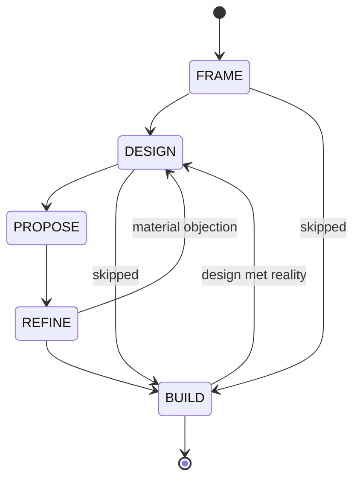

# Deliberate

## Overview

The gap this closes is **root cause → code**. The user is good at diagnosis and skips everything after it, because code is the cheapest next action and a ticket is not.

**Core principle: the lever is cost, not permission.** Every state's artefact is drafted before the user arrives at it, so the deliberate path becomes the cheap one. A skill that waits to be asked has already failed.

**No state has a precondition.** The user drives. When they move past something, say so **once**, write it down, and do what they said.

**One artefact.** The ticket carries the problem *and* the proposed design, and it is what the user walks a colleague through. There is no second document, no briefing, no chat-only design. Anything that matters goes in the ticket, because the ticket is what leaves the room.

## States



| State | What you draft, unprompted | What the readback checks |
|---|---|---|
| **FRAME** | The ticket — problem, evidence, impact. Via `chalk:issue`. | Solution words in the problem statement; unverified causes not tagged `assumption:`; no statement of who it hurts |
| **DESIGN** | The design, **into the same ticket** — two options differing in kind, a recommendation, non-goals, open questions | A missing non-goals section; one idea at two sizes posing as two options; an open question that does not say what its answer changes |
| **PROPOSE** | Nothing new — a **cold-read pass** over the ticket, then park | Anything in the ticket that only parses if you sat in this session |
| **REFINE** | The ledger — every point from the conversation, resolved | A point left `open`; a rejection with no reasoning recorded |
| **BUILD** | Normal work | The design section the code has just contradicted |

## Reply format

Every reply while this skill is active:

```
[STATE]

<the body — a mindmap, per the Chalk mindmap output style>

<the readback, if a state changed: one line>

next: [D] DESIGN · [P] PROPOSE · [B] BUILD (skips PROPOSE) · [K] park
```

- **The state tag and the `next:` line sit outside the tree.** They are scaffolding, not nodes — do not bullet them.
- **`next:` offers the states reachable from here, including the skips**, each with a single-letter ID so the user can answer `P` and nothing else. Name what a skip skips.
- **A tl;dr, where the body earns one, goes at the bottom** per the chat output style — above the `next:` line, which is always last.
- **The readback is one line, on the transition, and never returns.** Repeating it is nagging, and nagging is how the skill gets switched off.

## PROPOSE is the user's action, not yours

The user opens the ticket and talks it through with **one colleague**. You are not in the room and you produce no separate artefact — if it is worth saying in that conversation, it was worth putting in the ticket during DESIGN.

**Your one job is the cold-read pass.** Read the ticket as someone who did not see the session:

- **Cut what only parses from in here** — "the fix we discussed", a decision with no reasoning under it, a symptom described by how we found it rather than by what it does.
- **Check the design is walkable top to bottom.** They will read it in front of you; a reader who has to jump around will fill the silence with agreement.
- **Check every open question says what its answer changes.** That is what turns "any thoughts?" into a question with an objection in it, and it lives in the ticket where it persists.

Then **park**. The next input is the user returning with what was said.

Open REFINE with the debrief: what was said, what surprised them, what they have quietly conceded. People arrive from these conversations having already changed their mind without noticing; the ledger is where that becomes explicit.

## The ledger

Lives in the `chalk` comment on the issue and follows `chalk:voice` completely: subject lines carrying the point, bold on the load-bearing words, children backing up their parent.

**Name no one.** The point is the artefact; who raised it is not.

```markdown
- **The freshness check belongs in a new rule, not an edit to the existing one**
  accepted: SpendStoredPlanOnApply is about spending the plan, not about whether the plan is still true.

- **CI should warn rather than fail on a stale plan**
  rejected: CI is where a silent wrong apply does the most damage, so it is the place to fail loudest.

- **--fresh and re-planning may be entangled**
  deferred: no evidence either way, and the change stands whichever it turns out to be. Own issue.
```

- **A rejection MUST carry its reasoning**, because the person who raised it will read this.
- **`open` is not a resting state.** REFINE does not end with one.

## Resuming

The artefacts are the state. The user may have done a state without you, days ago.

- **Read the issue and its chalk comments first**, then say which state that puts them in.
- **Do not ask them to tell you where they are** if the issue can answer it.
- **A local file is not the record.** Everything lives where a colleague could read it.
- **A design that exists only in the chat is not a design.** Put it in the ticket before offering PROPOSE.

## Rationalisations — both of us

| Thought | Reality |
|---|---|
| "It's faster to code it than describe it" | True for the code, false for the second attempt at it |
| "I'll write the ticket afterwards" | A ticket written after the fix records the fix, not the problem |
| "They'll only say LGTM anyway" | Then the question was wrong. A question with no possible objection is not worth a colleague's time |
| "The design is obvious" | Then non-goals cost you one line, and the conversation is five minutes |
| "I'll start building while they think about it" | The half you build is the half you defend |
| "I'll draft the ticket once they confirm the approach" | Drafting unprompted is the whole mechanism (R8). Waiting to be asked is the failure |
| "I already mentioned the missing non-goals" | Then it is recorded. Say it once |

## Red flags

- A reply with no `next:` line
- A readback that argues rather than states
- The same readback twice
- A ledger with a name in it
- A ledger entry still `open` at the end of REFINE
- Asking the user to write an artefact you could have drafted
- A briefing, a summary, or a talking-points list that duplicates the ticket
- Blocking. Nothing in this skill blocks
